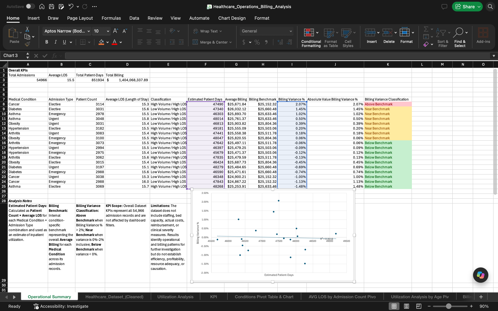

# Healthcare Operations & Billing Analysis
 
## Project Overview

This project analyzes 54,966 healthcare admission records in Microsoft Excel to evaluate patient volume, length of stay, admission patterns, estimated inpatient utilization, and billing variation.

The goal was to transform admission-level healthcare data into a management-facing operational report that identifies meaningful patterns and highlights areas that may warrant further investigation.

## Business Questions

The analysis was designed to answer questions such as:

- How does patient volume vary across medical conditions and admission types?
- Which combinations demonstrate higher patient volume and average length of stay?
- Which patient groups account for greater estimated inpatient utilization?
- How does average billing vary across medical conditions and admission types?
- Which admission types deviate most from condition-specific billing benchmarks?
- Is estimated inpatient utilization associated with billing variance?

## Tools & Excel Skills

- Microsoft Excel
- PivotTables
- PivotCharts
- XLOOKUP
- GETPIVOTDATA
- Nested IF and AND logic
- ABS
- Conditional Formatting
- Slicers and Report Connections
- KPI Reporting
- Internal Benchmarking
- Variance Analysis
- Scatter Plots
- Linear Trendline and R² Analysis

## Analysis Workflow

1. Prepared the admission-level dataset and created calculated fields including Length of Stay and Age Group.
2. Used PivotTables to analyze patient volume, admission patterns, length of stay, utilization, insurance providers, and billing.
3. Established internal benchmarks to compare patient volume, average length of stay, and condition-specific average billing.
4. Built a separate analysis layer using GETPIVOTDATA and XLOOKUP to retrieve and organize PivotTable results.
5. Calculated Estimated Patient Days and billing variance metrics.
6. Classified utilization and billing patterns using conditional logic.
7. Created KPI reporting, PivotCharts, slicers, and conditional formatting.
8. Developed an Operational Summary dashboard to communicate findings to management.

## Key Findings

### Operational Utilization

Elective Asthma admissions recorded 3,069 admission records with an average length of stay of approximately 15.7 days, resulting in approximately 48,268 Estimated Patient Days.

This combination exceeded the project's internal benchmarks for both patient volume and average length of stay, identifying it as a priority for further operational investigation.

### Billing Variation

Cancer Elective admissions had an Average Billing approximately 2.07% above the internal Cancer billing benchmark, representing the largest absolute billing deviation among the 18 Medical Condition × Admission Type combinations analyzed.

### Utilization vs. Billing Variation

A scatter plot comparing Estimated Patient Days with Billing Variance % produced an R² of 0.0018.

The fitted linear model therefore explained approximately 0.18% of the observed variation in Billing Variance %, indicating very little linear association between the two measures across the 18 combinations analyzed.

## Dashboard

The interactive Excel dashboard includes:

- Overall dataset KPI reporting
- Medical Condition and Admission Type slicers
- Estimated Patient Days analysis
- Billing variance analysis
- Conditional formatting for billing classifications
- Supporting trend analysis
- Detailed operational reporting

> **KPI Scope:** Overall dataset KPIs represent all 54,966 admission records and are not affected by dashboard filters.

## Metric Definitions

**Estimated Patient Days**  
Patient Count × Average Length of Stay for each Medical Condition × Admission Type combination.

**Total Patient-Days**  
Calculated from the sum of row-level Length of Stay values in the underlying admission records.

**Billing Benchmark**  
An internal condition-specific benchmark representing the overall Average Billing for each Medical Condition across its admission records.

**Billing Variance Classification**

- Above Benchmark: Billing Variance % > 2%
- Near Benchmark: Billing Variance % between 0% and 2%, inclusive
- Below Benchmark: Billing Variance % < 0%

## Limitations

The dataset does not include staffing levels, bed capacity, actual costs, reimbursement, or clinical severity.

Therefore, the analysis identifies operational and billing patterns for further investigation but does not determine efficiency, profitability, resource adequacy, or the causes of the observed differences.

## Project Files

- `Healthcare_Operations_Billing_Analysis_Excel.xlsx` — Complete Excel analysis and interactive dashboard
- `Healthcare_Operations_Dashboard.png` — Dashboard preview
